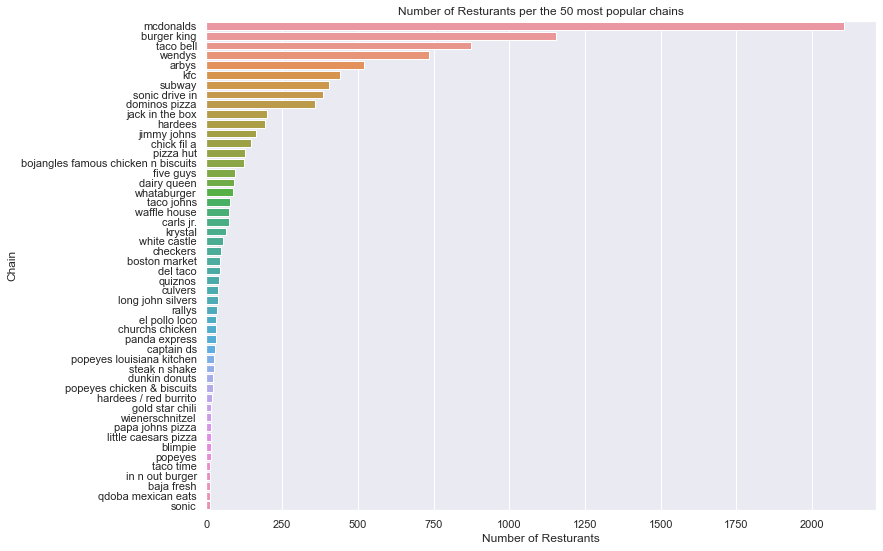

# Restaurant Locations

### What are the most popular fast-food restaurant chains? 

McDonald's is by far the most popular fast food restaurant chain in the US. 

Eventhough McDonald's top the list above it was not the first fastfood restaurant, the first fast-food chain is not even in top 10. 
However many of the famous, restaurants opened in the perid of 1940(mcdonalds) to 1965(subway & dominos). 
The expansion of fastfood restaurants began with a culture change, where as seen with McDoalds' meals no longer require preperation time, shopping, doing the dishes, not even a table as the concept is; *You can eat it with your bare hands*. This leads to a trend of american meals, where over 20% of meals are eaten in cars :blue_car: **[[11]](https://web.colby.edu/st297-global18/2018/10/29/americas-fast-food-obsession/#:~:text=One%20of%20the%20main%20reasons,and%20get%20a%20full%20meal)**.

# Positioning of fastfood restaurants acroos the us :us:

We start by exploring the 10 most popular  fastfood restaurants in the dataset. 

| Restaurant chain 	| No. of restaurants 	|
|---	|---	|
| Mcdonalds 	| 2105 	|
| Burger King 	| 1154 	|
| Taco bell 	| 873 	|
| Wendy's 	| 734 	|
| Arby's 	| 520 	|
| KFC	| 441 	|
| Subway 	| 404 	|
| Sonic Drive-In 	| 386 	|
| Dominos Pizza 	| 359 	|
| Jack in the Box 	| 201 	|
| Hardees 	| 194 	|

All these restaurants serve the same category of fastfood being either, 
* Fried chicken
* Burgers
* Sandwiches

However for all of them it is not unusual that a meal is easily 1200-1900 calories.
According to **[[12]](https://www.medicalnewstoday.com/articles/245588#:~:text=According%20to%20the%202015%2D2020,overall%20health%2C%20and%20activity%20level)** the daily needs for males and females are respectively;
* Male 2000-3000 calories
* Female: 1600-2400 calories

:::note 

Please note that the exact calories needed varies from individual to individual based on the amount of exercise and lifestyle

:::

This means that eating a burger og a sandwhich can account for more than the required daily amount or almost the required daily amount for many person. 

## Distribution of restaurants
With the data we created plotting the locations of restaurants. 

<iframe src="https://peetzie.github.io/SocialData_InteractiveMaps/fastfood_locations.html"
	sandbox="allow-same-origin allow-scripts"
	width="100%"
	height="500"
	scrolling="yes"
	seamless="seamless"
	frameborder="0">
</iframe>

:::tip 

Remember that you can turn layers of in the interactive figure in the top right corner and explore the locations of Fastfood restaurants yourself!

:::

:::caution Outliers
On the plot you will se a few outliers, as some of the restaurants seems to be located in Europe
:::

The map above shows a plot of locations of fastfood restaurants, each color corresponds to a specfic chain.
* Yellow: Mcdonalds 
* Orange: Burger king 
* Red: Taco bell
* Green: Wendy's 
* Blue: arby's

A clear pattern emerges from the plot; the majority of fastfood restaurants are on the east-side of the Country. 

According to **[[13]](https://worldpopulationreview.com/state-rankings/east-coast-states)** the East Coast states alone account for about 36% of the United States' total population. 
Thus it is no surprice that the vast majority of fastfood restaurants are located for ease of access to the majority of the population. 

Looking at the restaurants on the West Coast, it is very clear that is within the major cities of i.e Washington that the restaurants are distributed. 
Likewise a desert state like Nevada - Las Vegas accounts for a visible distribution on the State map! 

