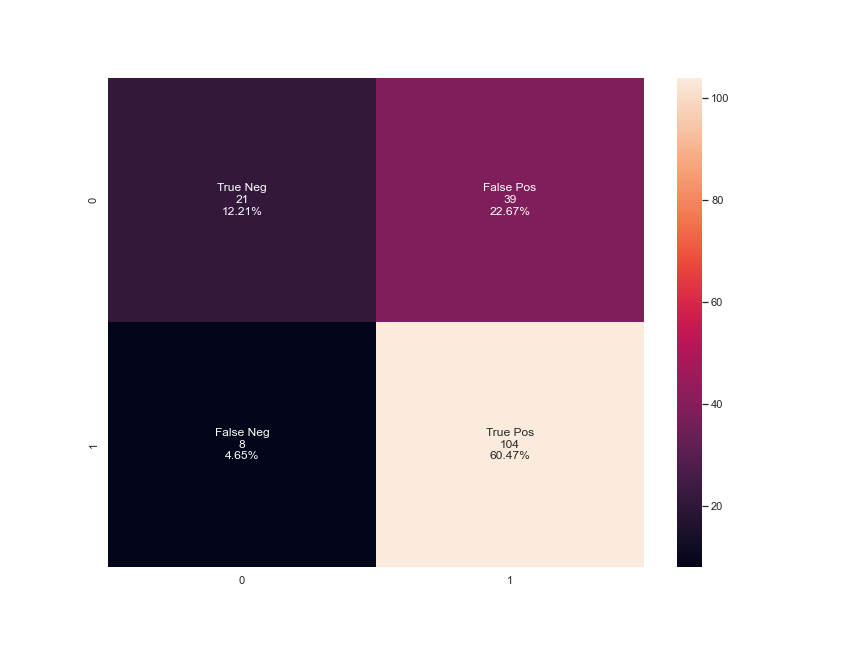
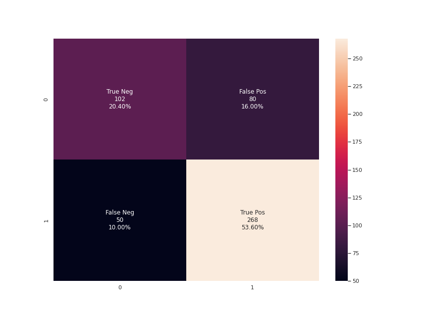

# Improving the model

To improve the model from a simple `Decisiontreeclassifier`, we opted for a solution with a `Randomforrestclassifier` which is basicly just multiple `Decisiontreeclassifiers`, where each of them has a vote and then the majority wins for a specific classification. 

With the basic `Randomforrestclassifier`we obtained far better results.

Comparing the two *Confusion matrices* the true postive rate has gone from 211 to 262, likewise the false positive has been reduced from 90 to around 68. 
As for the true negatives it reduced by a small bit from 119 to 114, however that is the cost of having correctly classified far more. 
Likewise the False negative was reduced from 80 to 56. 

With the different results from the confusion matrix we now obtained the following: 

* Accuracy of the model: 0.752
* Precision of the model: 0.793939393939394
* recall of the model: 0.8238993710691824
* F1-score of the model: 0.808641975308642

With an increase in both the precision and recall we are actually happy. 
Ofcourse it is better to get it right more times whether or not a county is obesed. But likewise with an increased recall we ensure that we get the most counties that can be considered obesed based on features, and thus are able to account for based on said features to improve public health in that county! 

### Further improving the model

The `Randomforrestclassifier` uses different *Hyperparameters* that can be tuned in order to improve the overall accuracy of the model. 
By performing `RandomSearchCV`to first establish how the hyperparameters act on the model and then `GridSearchCV`to find different parameters for the said model in an interval we were able to further improve the model accuracy. 
With the new *hyperparameters* we arrive with the following confusion matrix and measurements

* Accuracy of the model: 0.74
* Precision of the model: 0.7701149425287356
* recall of the model: 0.8427672955974843
* F1-score of the model: 0.8048048048048047

Based upon the measurements above we arrive with a model with less `accuray`, `Precison`. However an increase in the `Recall`and almost the same  `F1-score`.

Based on that and the confusion matrix numbers we see a model that identifies more true positives, but at the cost of more false positives and thus the increased `Recall`. Likewise we see a minor decrease in true negatives, but a reduction in false negaitves. As this doesn't classify whether one individual has a disease or is life critical for one individual, but rather identifies whether or not a county is more vulnerable of obesity or not it is a good thing to identify to many to try to prohibit this prediction. 