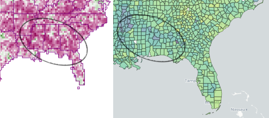

# The relation of income

The income of households can play a factor in deciding what food we eat. Fastfood is a cheap and easy source to food, and as seen it is widely spread across the United States. Sources tells us, that the fastfood consumption of adults increases with the family income level **[[11]](https://www.cdc.gov/nchs/products/databriefs/db322.htm)**.

From the data the 10 counties with the highest mean income is shown below:

|State|County|	Mean Income ($)|
|---	|---	|---   |
|Indiana	|Madison County|	162624.00|
|Maryland	|Montgomery County|	151535.33|
|Virginia	|Loudoun County|	142378.33|
|Arkansas	|Fulton County|	141250.00|
|North Dakota|	Cass County|	136797.00|
|Ohio	|Portage County|	134337.00|
|Kansas	|Johnson County|	134274.00|
|New York	|Westchester County|	132087.50|
|Colorado	|Boulder County|	131295.67|
|Rhode Island	|Providence County|	129181.00|

Due to missing data, the income variable has been omitted from our prediction model. However to still get a somewhat accurate picture of the income across the US, an interpolated image of the US is plotted. The values we do have is being spread out to other nearby counties with missing data, and is being impacted by all neraby values.
This gives a somewhat informative visualisation.

**Average income in the United States of America**
<iframe src="https://peetzie.github.io/SocialData_InteractiveMaps/income.html"
	sandbox="allow-same-origin allow-scripts"
	width="100%"
	height="500"
	scrolling="yes"
	seamless="seamless"
	frameborder="0">
</iframe>

:::tip

This map is interactive, you can hover over to find mean income in specific areas 

:::

The green seems to spread especially near big cities, whereas the more red/purpleish colors are in the rural areas of the US. This corresponds with farming areas of with a lower income compared to monopolistic cities🏢. 

Refering back to the FEI plot it looks like in a few spots there could be some small relation of the income and FEI as expected per the definition of FEI, but could also be a coincidence, as the remainder seem fairly randomly distributed and hard to distinguish significant differences. 

## Obesity in the US
** Adult obesity percentage in the United States of America**
<iframe src="https://peetzie.github.io/SocialData_InteractiveMaps/obesitypercentage.html"
	sandbox="allow-same-origin allow-scripts"
	width="100%"
	height="500"
	scrolling="yes"
	seamless="seamless"
	frameborder="0">
</iframe>

:::tip

This map is interactive. Feel free to look around and see if you can find any patterns or zoom in or out to get a better view

:::

Looking at the distribution of the percentage of obesed citizens across the US and food enviroment index scores there could be some relation. 
Likewise the map above clearly confirmes **[[12]](https://www.ncbi.nlm.nih.gov/pmc/articles/PMC4214609/)**, that the majority of the US population is obesed. 

Looking at the South east part of the country we see an increased amount of obesity, whilst in the food scoring index having a lower score comparead to the rest of the east coast. 

Comparing this to the plot of income 💲, we see that in the area with green/white coloring in the north west region of the country, we also have some scoring in the lower end of the obesity percentage. 
Likewise in the south east end of the country we see a high obesity percentage whilst having an average low income. 
This could indicate som relation between the two features.

:::caution

It appears that there perhabs is some sort of relation between obesity percentage, income and FEI, never the less income wont be taken into account in the final predictive model, as the data is interpolated and some of it missing. 

:::