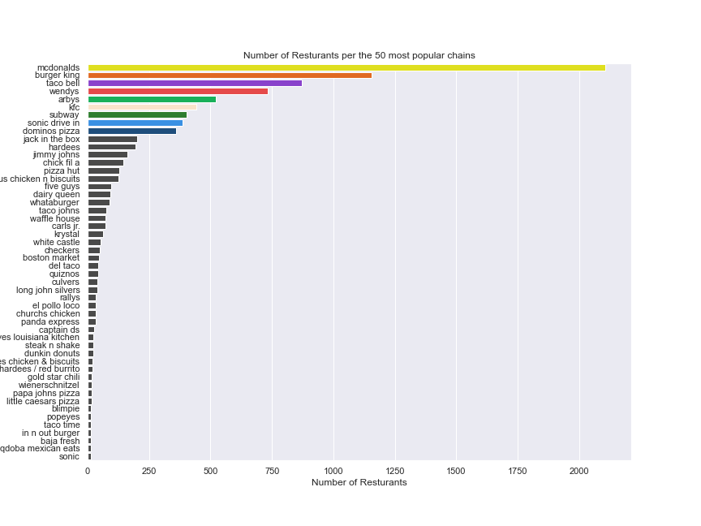

# Restaurant Locations

### What are the most popular fastfood restaurant chains? 

First to get an overview of the fastfood restaurants a bar plot of the number of restaurants per fastfood chain is visualised. 

**Number of restaurants per restaurant chain** 

:::tip

Static plots can be clicked and opened in a seperate view, here you can zoom in on the details you like 🔍

:::

McDonald's is by far the most popular fast food restaurant chain in the US. 

Even though McDonald's is on top the list, they were not the first fastfood restaurant, the first fast-food chain is no 24, White Castle. The expansion of fastfood restaurants began with a culture change where, as seen with McDoald's, meals no longer required preperation time; grocery shopping, cooking, doing the dishes, not even a table as the concept is; *You can eat it with your bare hands*. This leads to a trend of american meals, where over 20% of meals are eaten in cars :blue_car: 
**[[11]](https://web.colby.edu/st297-global18/2018/10/29/americas-fast-food-obsession/#:~:text=One%20of%20the%20main%20reasons,and%20get%20a%20full%20meal)**.

# Positioning of fastfood restaurants across USA 📍🇺🇸

Looking further into the top 9 of the fastfood restaurants and then grouping the other restaurants as 'other'. 

| Restaurant chain 	| No. of restaurants 	|
|---	|---	|
| Mcdonald's 	| 2105 	|
| Burger King 	| 1154 	|
| Taco bell 	| 873 	|
| Wendy's 	| 734 	|
| Arby's 	| 520 	|
| KFC	| 441 	|
| Subway 	| 404 	|
| Sonic Drive-In 	| 386 	|
| Domino's Pizza 	| 359 	|

The majority of these restaurants serve the same category of fastfood being either, 
* Fried chicken 🍗
* Burgers 🍔
* Sandwiches 🥪

Furthermore it is not unusual that a meal from any of these restaurants is easily 1200-1900 calories. Comparing to the average recommended daily needs for females and males are respectively **[[12]](https://www.medicalnewstoday.com/articles/245588#:~:text=According%20to%20the%202015%2D2020,overall%20health%2C%20and%20activity%20level)**;
* Female: 1600-2400 calories
* Male 2000-3000 calories

:::note 

Note that the exact calories needed varies from individual to individual based on e.g. amount of exercise, genetics and lifestyle

:::

This means that consuming a menu from a fastfood restaurant can account for more than the required daily amount of calories. It has previously been confirmed that different counties with easier access to fastfood restaurants can be connected with obesity in the respective county, whereas easier access to grocery stores proved that people consumed more fruit and vegetables and were less likely to be obese **[[13]](https://www.nature.com/articles/s41467-021-27522-y)**. 

## Distribution of restaurants
With the data we created plotting the locations of restaurants. 

<iframe src="https://peetzie.github.io/SocialData_InteractiveMaps/Fastfood_locations.html"
	sandbox="allow-same-origin allow-scripts"
	width="100%"
	height="500"
	scrolling="yes"
	seamless="seamless"
	frameborder="0">
</iframe>

:::tip

This map is interactive, you can adjust the layers (restaurants) in the top right corner. 
Likewise if you click on a specific restaurant, you will retrieve additional info like the address

:::

:::caution Outliers
On the plot you will se a few outliers, as some of the restaurants seems to be located in Europe. These are removed later when a machine learning model is fitted.
:::

The map above shows a plot of locations of fastfood restaurants, each color corresponds to a specfic chain: 
McDonald's

Burger King

Taco Bell

Wendy's

Arby's

 KFC

Subway

Sonic drive-in

Domino's Pizza

Other

A clear pattern can be seen in the plot; the majority of fastfood restaurants are on the east-side of the Country. 

The East Coast states alone account for about 36% of the United States' total population👪 **[[14]](https://worldpopulationreview.com/state-rankings/east-coast-states)**.
Which could be a part of the explanation as to why the majority of fastfood restaurants are located in the eastern part of USA. 

Looking at the restaurants on the West Coast, it is mostly within big cities, e.g. Washington, that the restaurants are distributed. Likewise a desert city like Nevada - Las Vegas accounts for a large amount of fast food restaurants. 

